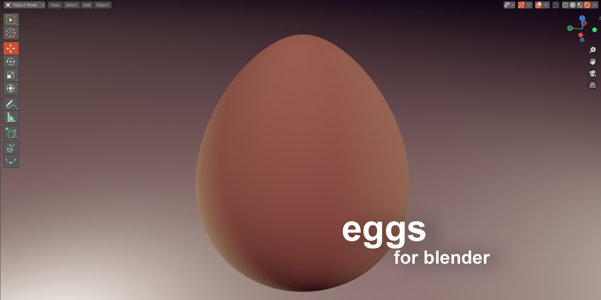

# Egg-Object-for-Blender 1.0.1

Creates a parametric egg as mesh object 

Go to Add Menu -> Mesh-> Essentials -> Egg

# Buy me a coffee

Hej, I offer this addon for free, but if you like it, you can support me and buy me a coffee on ko-fi. If you can't afford it, don't worry, as I said it's free. Anyway I hope you enjoy this addon. 

Stay healthy!

Thanky you! 

# Installation

- Use "clone or download" to download 
- Extract the python file (.py) from the zip archive 
- Install the extracted python file within blender  (Edit Menu -> Preferences -> Addons)
- Activate "Object: Egg Object"

# What's new

V 1.0.1
  - Fixed Normals
  - Fixed Dimensions

V 1.1.0
  - New Settings
    - Toggle for Smooth or Flat Shading
    - Optimized Poles ( less vertices and smoother shading at the poles )
  - Fixed Dimensions
  - Including UV Generation now! 
